# Automating VPC Operations with Lambda

## Introduction

### Why combine Lambda with VPC Operations?

#### Event-Driven Network Operations

* Update network configurations in response to change in other AWS resources.
* Automatically react to changes in network traffic or utilization.

#### Improving Security

* Automate the enforcement of security rules and standards.
* Respond to potential security threats or unusual network activities.

#### Automate Network Tasks

* Automatically adjust network Access Control Lists (ACLs).
* Create and delete subnets based on demand or schedules.
* Configuring security group rules to adapt to changes in your environment.
* Ensure optimal usage of our resources.

A practical example of the benefit of automating network tasks and saving money by doing so would be to:
*Automating Elastic IP Management with AWS Lambda*

#### Elastic IPs (EIPs)

* Static, public IPv4 addresses that you can allocate to your account.
* To use an Elastic IP address, you first allocate one to your account, and then associate it with a network interface or an instance.
* You can use an EIP to mask the failure of an instance or software by rapidly remapping the address to another instance in your account.
* While EIPs are free when they are associated with an instance, there is a small hourly change when an EIP is no being used.

If you have several EIPs that are not in used (associated with an instance) you can use a Lambda function to check for the ones that are not associated and release them to save the cost to having them. This can be done by having a EventBridge trigger every day.
This shows how we can automate and streamline VPC operations and tasks using Lambda.

#### Applying Lambda & VPC

##### Real scenarios

Scalability & Efficiency

Lambda con be set to automatically adjust the number of instances within a VPC based on the current load. This ensures you’re using resources optimally.

* Peak usage times: launch additional instances.
* Off-peak time: terminate unnecessary instances.
* Keeping costs in check

Security

Lambda can be used to automate security checks, such as verifying that all Security Groups in a VPC follow organizational guidelines.

If a security group is found not in compliance, Lambda con automatically send notifications or even adjust the rules to match the standards.

DevOps

Teams can use Lambda to automatically assign or unassign Elastic IPs to instances when they are launched or terminated, ensuring optimal resources utilization and cost-efficiency.

## Hands-on

### Scenario

A company regularly uses Elastic IPs for EC2 instance but at times some of these IPs are left unassociated and result in unnecessary costs. The task is to automate the process of checking for these unassociated Elastic IPs and releasing them.

### Overview

A Lambda function that is triggered daily by Event Bridge. The Lambda function will check for any unassociated Elastic UP addresses in our VPC and release them. This way, it is ensure that unnecessary costs from unused Elastic IPs.

### Prerequisites

1. Boilerplate (default) Python Lambda function ‘ManageEIPs’ downloaded into Cloud9 environment.

## Steps

### Step 1

Let us go to the EC2 console to create the instance: for most of the options select the default option, select your key pair of preference and launch it.

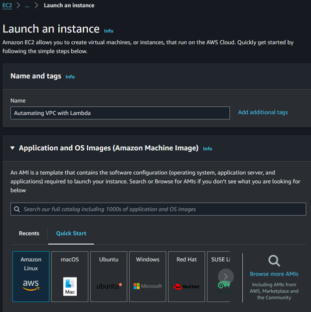
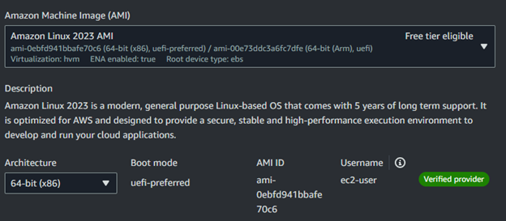
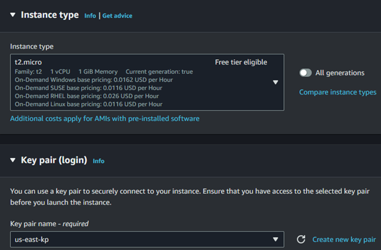
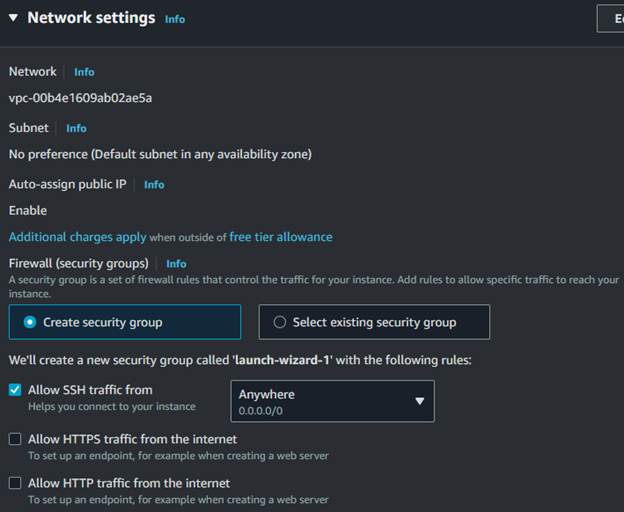
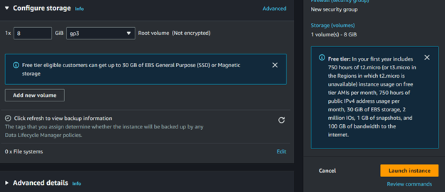

### Step 2

Now go to the “Elastic IPs” in the “Network & Security” group, create the elastic IP addresses with the default options.

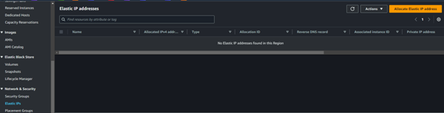
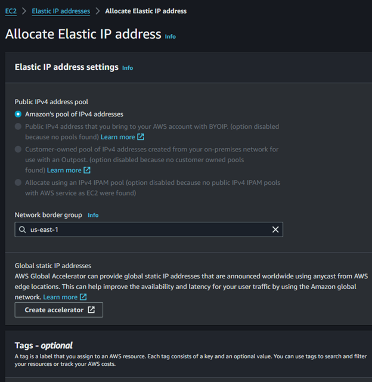

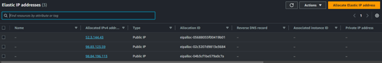

### Step 3

Select one of the EIPs to be allacated to the EC2 instance: go to Actions with the address selected and choose “Associate Elastic IP address”

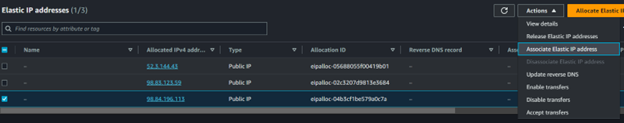

### Step 4

Select the instance and click in "Associate"

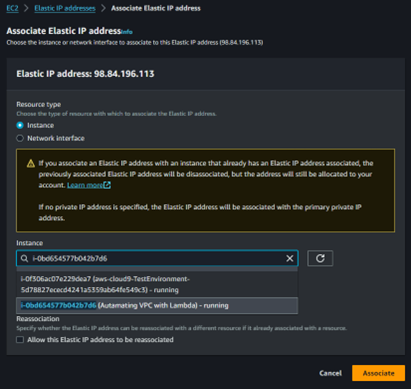

_In this case for testing porpuses take note of one of the EIP’s “Allocation ID” (eipalloc-05688055f00419b01)_

### Step 5

Go to Cloud9 to your lambda function, create your files for testing the function locally (event.json & template.yaml).

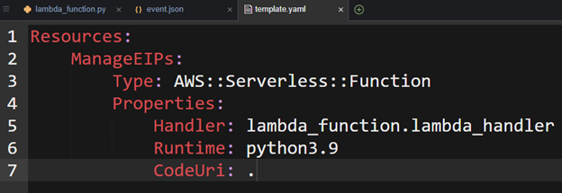
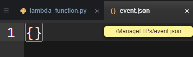
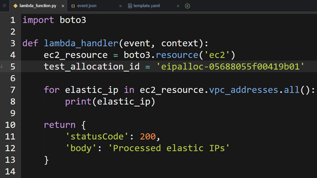
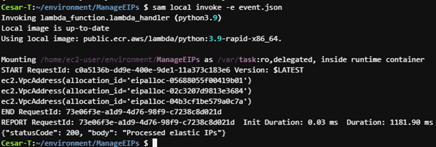

### Step 6

With an if statement we can filter the instances that are not associated and erase them:

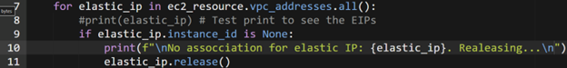

### Step 7

Upload the lambda function:

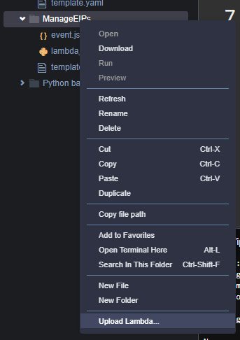
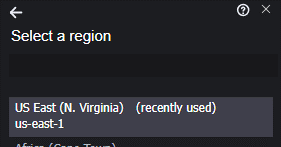
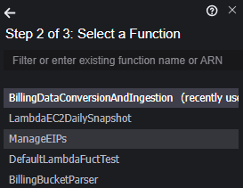

### Step 8

Give permitions to the function:

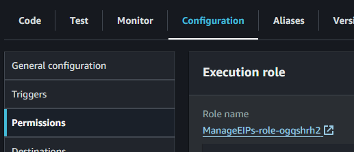

Attach a policy to the function:

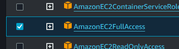

Add a trigger:

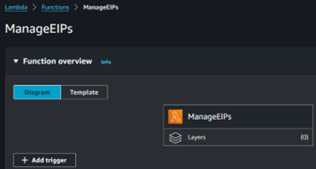
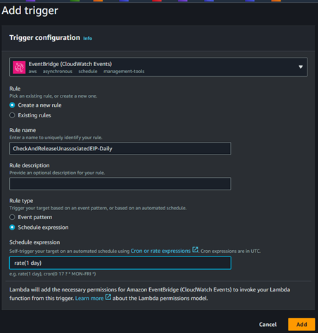

_If a error is encontered when running the trigger, such as “…function time out after time…”, this can be solved by encrecing the time for the function to time out._
