# Undenstanding and Using SNS, SQS, and SES with Python

## Introduction

### Amazon Simple Notification Service (SNS)

It is a full managed messaging service for communication:

* Application-to-application (A2A)
* Applica-to-person (A2P)

Supports the publishing of messages to multiple subscribing endpoints or clients.

SNS Topic:

* A logical access point and communication channel. They act as a hub for publishing messages and subscribing to notifications.

  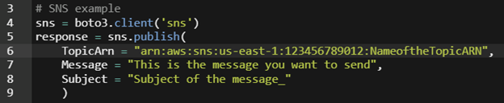

### Amazon Simple Queue Service (SQS)

A full managed message queueing service that enables you to decouple an scale:

* Microservices
* Distributed systems
* Serverless applications

Eliminates the complexity and overhead associated with managing and operating message-oriented middleware.
Stores messages on multiple servers for redundancy and to ensure message durability.

  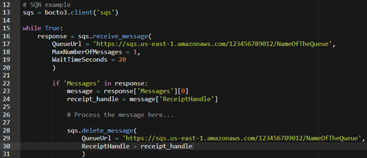

### Amazon Simple Email Service (SES)

It is an emailing service designed to send:

* Marketing
* Notifications
* Transactional emails

Allows us to esasily automate email notifications.

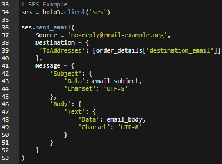

## Steps

### Scenario

A company has a system for validating CSV billing files stored in an S3 bucket for North American customers. To get real-time international takt data, you need to make a 3rd  party API call. Occasionally, errors might occur during calls to a 3rd party service, which will prevent the billing file from being processed correctly. Your task is to automate the process of handling these errors, notifying the relevant employes, and ensuring error-related information is stored for further investigation.

#### Overview

We will modify the finalized version of the “Automating S3 with Lambda: Real-time Data Validation HOL” by creating an additional lambda ‘RetryBillingParsel’ function, and SNS topic, and a SQS queue. If there is an error in the ‘BillingBucketParser’ function’s mock API call to a 3rd party service ‘BillingBucketParser’ publishes to the SNS topic. An email is sent will be sent will be sent out and a subscribed SQS queue triggers the ‘RetryBillingParser’ function. This function re-attempts the bata validation.

#### Prerequisites

* Completed Automating S3 with Lambda: Real-time Data Validation HOL
* Boilerplate Python Lambda funtion "RetryBillingParse"
* S3 bucket "dct-billing-processed"

### Step 1

1. Create the SNS topic - Go to SNS console and in the Topics section create a new topic:

   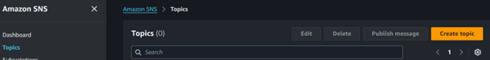

   Select the standar time, give it a name and create it:

   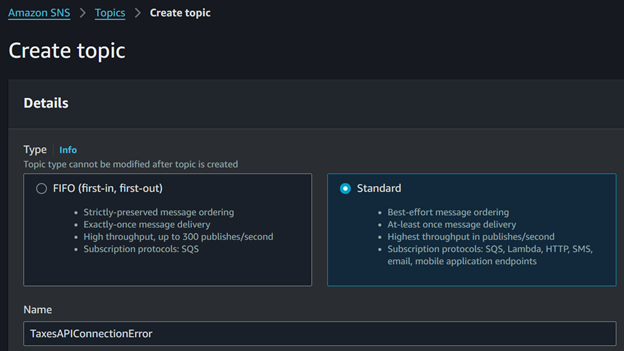

### Step 2

Create a subscription to an email - this will allow to get an email when their is an error with the API call.

1. Go to the SNS console and in the subscription section create a new subscription:

   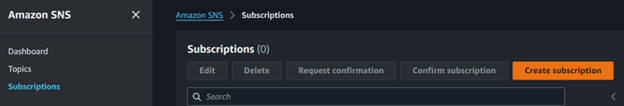

2. Make sure that the topic ARN is the correct for the topic just created, then select `Email` as the protocol. For the email, put an email you have access to, then you can create the subscription.

   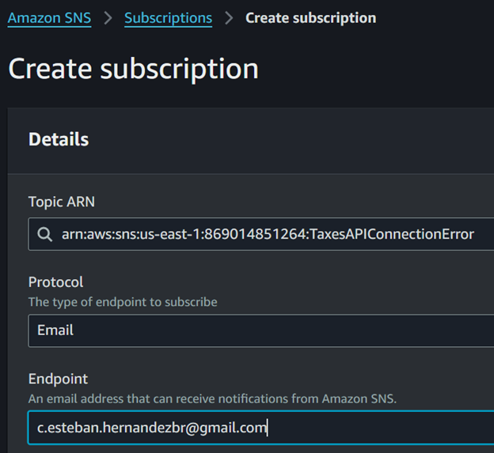

   _After creating the subscription, make sure to go to your email and confirm the subscription, once done you will see the status as confirmed for the subscription._

### Step 3

Take not of the ARN of the topic, as this is going to be needed with coding later.

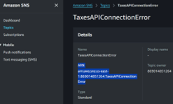

### Step 4

Now to do a make sure the is no events affecting the S3 bucket:

1. Go to the S3 console, and select the bucket:

    * Go to properties, scroll down to the event notifications and delete any current event, "Lambda trigger".

      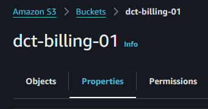
      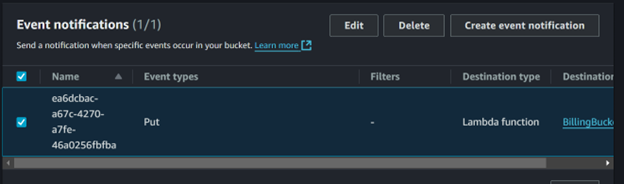

_As we are going to be working in Cloud9 with this lambda function and testing, we want to make sure any trigger to be activated while doing so._

For the example we will be using a file with no errors in it for testing porpuses.

### Step 5

Let us go to cloud9 and modify our lambda "BillingBucketParser" that we created previously.

1. Here we are going to write the function that makes a fake call to the API.

   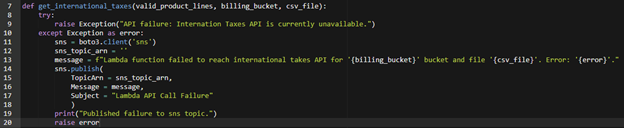

   _Before test it, we need to handled the case when there is no error._

2. At the end of the code, where we check the if error found, we copy all the code including the except handlying and replace the else content with the copied one.

   Before:

   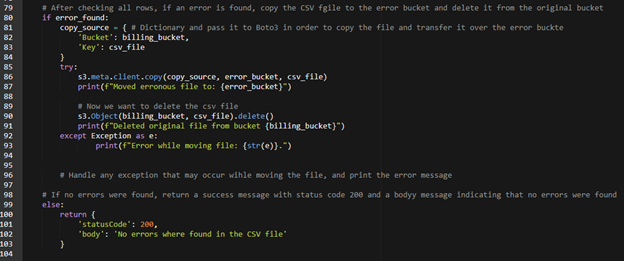

   After:

   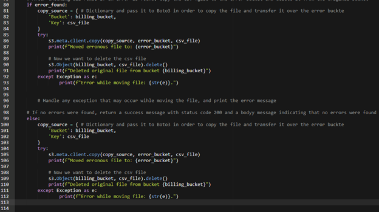

   _Need to change the variable from error bucket to the processed_bucket variable_

   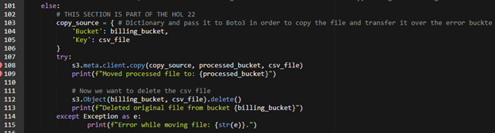

3. Add the variable porcessed_bucket in the beginning of the code:

   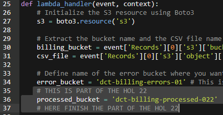

4. Let us prepare the lambda function for testing:

   * Modify the event.json file to reflect the file you are going to be using for the testing

   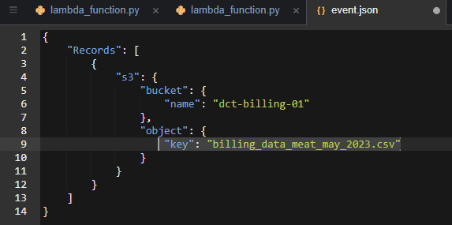

   * This is going to test the function in the case that there is no errors in the file, so it will move the file to the processed bucket.

     * Run the $ sam local invoke -e event.json

       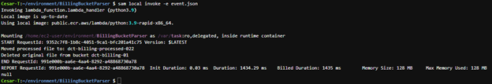

   * Once working let us test the case when there is an error conecting to de API

     * Let us add the file again to the billing bucket and errase the one from the processed bucket.
     * Back in Cloud9 we need to call the the function that we wrote an call it before we start to parse the CSV data:

       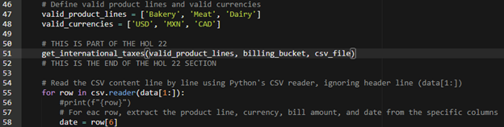

     * Then run again the function:

       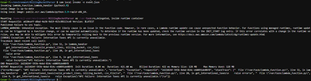

## Outcome

A email is send to the email address when the script finds an error in a file and sends a email to warn the team.

## Conclution

This API calls helps the teams to automate the finding of errors and events that are relevant for the teams.
