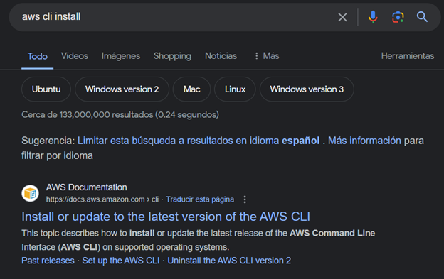
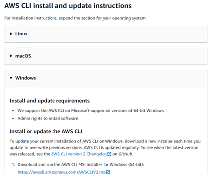
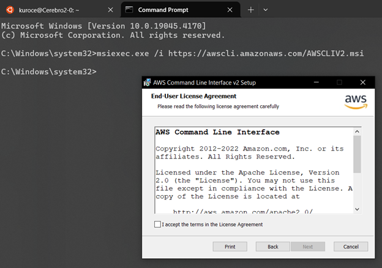
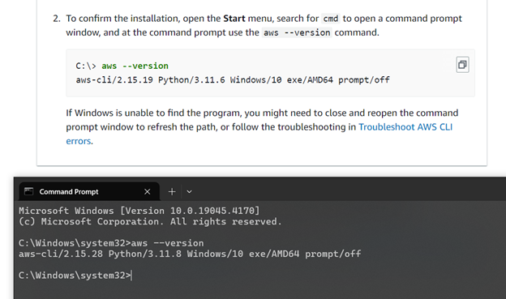

# Setting up AWS CLI in local machine (WSL)

## Introduction
Programatic access to AWS services can be obtained using AWS CLI.
Pretty useful when you want to automate tasks or use AWS from your local machine.

## Steps

**Step 1:** Look for "AWS CLI install" in the search bar on any browser, usually the first link is the official AWS documentation. Click on it.



**Step 2:** Follow the instructions on the official AWS documentation to install AWS CLI on your local machine.



**Step 3:** Confirm the installation by running the following command in your terminal:
```aws --version```



## Outcome

<outcome text>

## Conclution

<Conclution text>
