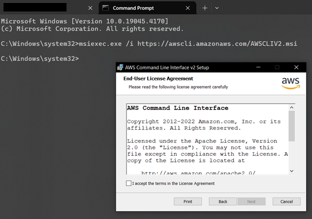
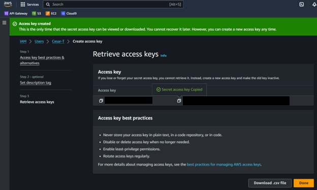

# Setting up AWS CLI in local machine (WSL)

## Introduction
Programatic access to AWS services can be obtained using AWS CLI.
Pretty useful when you want to automate tasks or use AWS from your local machine.

## Steps

**Step 1:** Look for "AWS CLI install" in the search bar on any browser, usually the first link is the official AWS documentation. Click on it.


**Step 2:** Follow the instructions on the official AWS documentation to install AWS CLI on your local machine.




**Step 3:** Confirm the installation by running the following command in your terminal:

```bash
aws --version
```


After this if you try to run a program the mussage "Unable to locate credentials" is going to show up.

**Step 4:** Enable the credentials using the AWS account.

* Go to AWS Console and search for the Identity and Access Management (IAM).
* In the menu on the left click the "Users" option unde Access Management.


* Create a user, you can also use a accesss already created
* For this we need the access key and the secret access key



**Step 5:** Go back to your terminal and run the command:

```bash
aws configure
```

* It is going to ask for the access key just generated and then for the secret access key, select default region and your preferable output format.


## Outcome

Once the configuration is complete, you should be able to interact with AWS services directly from your terminal using the AWS CLI. For example:

1. Run the following command to list all S3 buckets in your account:
    ```bash
    aws s3 ls
    ```

2. If the configuration is correct, you will see a list of S3 buckets associated with your AWS account.

3. You can now execute other AWS CLI commands to manage resources, such as EC2 instances, DynamoDB tables, or Lambda functions.

If you encounter any errors, double-check the access key, secret access key, and region provided during the configuration process.

## Conclution

We have walked through the steps to set up AWS CLI on your local machine, configure it with your AWS credentials, and verify its functionality. By completing these steps, you now have the ability to interact with AWS services programmatically from your terminal. This setup is essential for automating tasks, managing resources, and integrating AWS services into your development workflow. If you encounter any issues, refer back to the steps outlined above or consult the official AWS documentation for further assistance.
