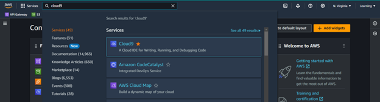
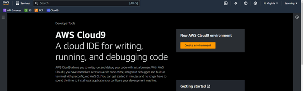
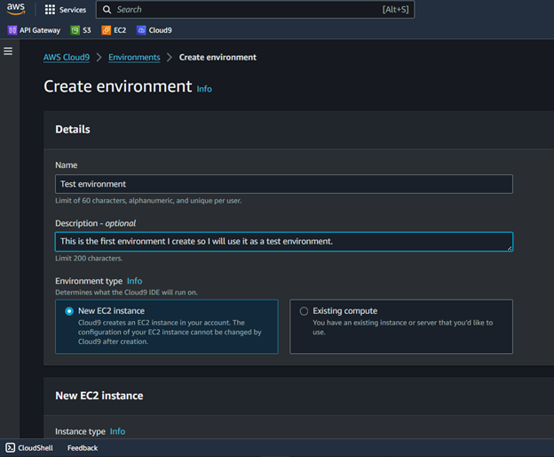
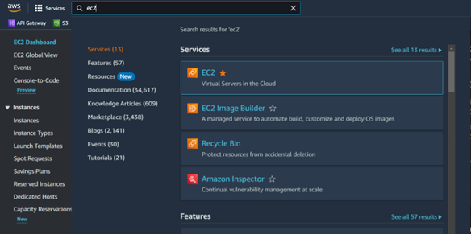
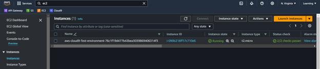
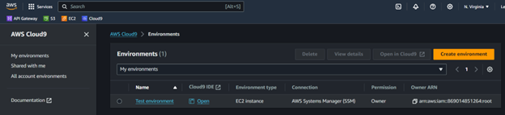
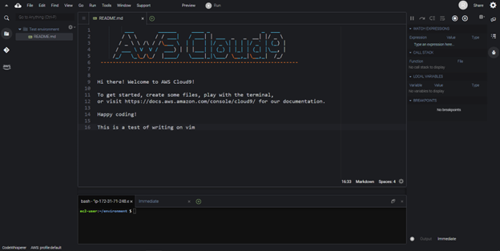

# Creation of an IDE environment in AWS Cloud9

## Introduction

This document describes the steps to create an IDE environment in AWS Cloud9.

## Steps

**Step 1:** From the home console, look for the Cloud9 service in the search bar.

**Step 2:** Click on the "Create environment" button.

**Step 3:** Fill-up the form with the desired name, description and specifications for the environment.

**Step 4:** Check the EC2 instance type that was created for the Cloud9 environment.

* You can check under instaces that the EC2 instance is running and is associated with the Cloud9 environment.

**Step 5:** Now going back to the Cloud9 console, go to the environments section.

* You can see the environment listed there.
* Click on the "Open" field to open the Cloud9 IDE.

## Outcome

You have successfully created an IDE environment in AWS Cloud9 and accessed it.
You should be able to see the IDE environment with the terminal and the code editor.

## Conclusion
Cloud9 has a terminal, code editor, and a preview window that can be used to develop code in multiple languages. It also has a built-in debugger that can be used to debug code.
It is a powerful IDE that can be used to develop code in the cloud. It is a great tool for developers who want/need to work from anywhere and have access to their codebase.
